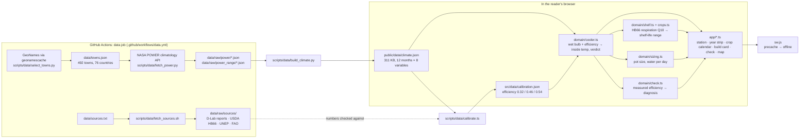

# Architecture

Zeer is a static site. Every number a visitor sees is computed in their browser from a climate snapshot that ships with the page. There is no backend, no API key and no account, and after the first visit it works offline.

## Why a data job in CI

The cloud VM that built Zeer has an egress allowlist: GitHub and npm are reachable, NASA POWER, USAID/MIT data, FAO and the USDA PDF are not. So the fetch runs on GitHub's runners and commits the results to `data/raw/` (`Data snapshot …` commits). The snapshot is the source of truth. `data/raw/` is fetched raw data, and everything downstream of it is a script in `scripts/data/`, so anyone can rebuild `public/data/climate.json` and `src/data/calibration.json` from scratch.

## Components

| Path | What it does |
|---|---|
| `src/domain/psychro.ts` | Moist-air physics from ASHRAE Fundamentals (2017) ch. 1: Hyland–Wexler saturation pressure, humidity ratio, dew point, and the thermodynamic wet-bulb temperature solved by bisection on ASHRAE eq. 33/35. Stull (2011) is implemented only as a cross-check in the tests. |
| `src/domain/cooler.ts` | The pot model: `T_inside = T_air − ε(T_air − T_wetbulb)` for the day average and for the hottest hours, with ε as a low/mid/high range; month verdicts; year summary; month runs that wrap December → January. |
| `src/domain/crops.ts` | Nine crops the pot suits and four things it must never hold, every value from USDA Agriculture Handbook 66 (storage group, lowest safe temperature, respiration rates). |
| `src/domain/shelf.ts` | Shelf-life multiplier `Q10^(ΔT/10)` from the day-average drop, with the crop's own Q10 (HB66 respiration) or Kader's generic 2–3. |
| `src/domain/sizing.ts` | Inner pot size from capacity (10–100 L, D-Lab), outer pot with 5 cm of sand, water per day from an energy balance. |
| `src/domain/check.ts` | Two thermometer readings → measured efficiency → diagnosis against the calibrated band. |
| `src/domain/towns.ts` | Accent-insensitive town search (names, alternate names, countries) and nearest town by great-circle distance. |
| `src/app/*` | The interface, plain TypeScript + DOM + SVG (no framework): `station` (town combobox, headline, month, pot), `pot` (the cross-section drawing), `year` (dumbbell strip, radiogroup with drag-to-scrub), `crops` (calendar table), `build`, `check`, `map` (lazy-loaded d3-geo), `store` (state + shareable URL hash), `derive` (memoised per-town model). |
| `src/i18n/*` | English, French and Spanish copy; month names from `Intl`. |
| `vite.config.ts` | Relative base (`./`), plus a plugin that writes `sw.js` with the exact file list of each build. |

## Key algorithms

### 1. Wet-bulb temperature, done properly

NASA POWER offers a `T2MWET` field, but in the snapshot it is simply `(T2M + T2MDEW) / 2` (Mopti, March: 15.09 = (29.98 + 0.21) / 2). That average overestimates how cold evaporation can get in dry air. Zeer instead computes the thermodynamic wet bulb from temperature, specific humidity (`QV2M`) and surface pressure (`PS`) by bisection on ASHRAE eq. 33. The tests check it against steam-table saturation pressures, against Stull's formula across 42 hot-climate conditions (within 1 °C), and against psychrometric-chart readings.

### 2. The typical afternoon, not the monthly extreme

In the climatology endpoint `T2M_MAX` and `T2M_MIN` are the month's extremes (Mopti, March: 43.2 °C), not the mean daily maximum. Zeer takes the typical afternoon as `T2M + T2M_RANGE / 2`, where `T2M_RANGE` is the mean daily temperature range (Mopti, March: 38.5 °C). Humidity for the afternoon keeps the day's moisture (specific humidity barely changes over a day) at the afternoon temperature.

### 3. Calibrating the pot on field data

The efficiency ε is the one free parameter. `scripts/data/calibrate.ts` rebuilds the conditions of MIT D-Lab's 2017 Mali study from the same NASA climatology (Mopti and Bamako, March–July, only the months that meet the study's stated conditions: RH < 40 %, day-average 29–37 °C). The mean wet-bulb depression of those months is 14.74 °C. ε is then the value that reproduces D-Lab's measured average decreases:

| D-Lab device (Executive Summary, 2018) | Average decrease | ε |
|---|---|---|
| Cylinder pot-in-dish (worst clay pot) | 4.7 °C | 0.319 (low) |
| Pot-in-pot | 6.7 °C | 0.455 (mid) |
| "greater than 8 °C … in a real-world usage scenario" (D-Lab page) | 8.0 °C | 0.543 (high) |

A unit test asserts the mid value still reproduces 6.7 °C, so the calibration can't drift silently.

### 4. Month verdicts

On the day-average drop at mid efficiency (the quantity D-Lab measured): **works well** ≥ 5 °C (the bottom of D-Lab's "5 to 7 °C lower than the ambient"), **helps a little** ≥ 2.5 °C, **too humid** below that, and **mild month** when the typical afternoon is under 25 °C (D-Lab: coolers help most above 25 °C).

### 5. Shelf life

Kader (2002): above the optimum, deterioration speeds up 2–3× per 10 °C and tracks respiration. HB66 table 1 gives respiration rates at 0–25 °C, so each crop gets its own Q10 from the warmest 10 °C step reported (tomato 1.95, okra 2.36, spinach 2.09, pepper 2.83, cabbage 2.21, mango 3.23, cucumber 1.28). Eggplant (one temperature only) and carrot (non-monotonic above 15 °C) fall back to Kader's 2–3. The displayed range carries the efficiency spread, and it is applied to the seller's own "lasts N days on the table", never to an invented baseline.

### 6. Water per day

Steady state, sensible heat the wet outer wall gains from the air = latent heat carried off by evaporation: `m·L = h·A·(T_air − T_wall)·t`, with `h` 5–10 W/m²K (still to lightly moving air around a shaded pot), `A` the outer pot's wetted side, `T_wall` ≈ the inside day-average. A 50 L pot in Mopti in March comes out around 1–2 litres a day, consistent with D-Lab's "once per day" watering.

## Data flow in the page

1. `index.html` loads `main.ts` (25.5 kB gzipped) and two self-hosted variable fonts.
2. `main.ts` fetches `data/climate.json` (relative URL, so it works under any Pages path), picks the town from the URL hash or defaults to Mopti (D-Lab's field region), and opens on the current month if the pot works then, otherwise the town's best month.
3. `Store` holds `{town, month, crop, lang, unit, litres, baselineDays}`; every view subscribes and re-renders its own DOM. The state is mirrored into the URL hash (`#t=…&m=…&c=…&l=…&u=…`), so any view can be shared as a link.
4. The map section imports d3-geo and Natural Earth's 110 m land only when it scrolls within 600 px of the viewport.
5. `sw.js` precaches the build; the second visit works with no connection.

## Trade-offs

- **Monthly climatology, not daily weather.** It answers "is this worth building for this season?", not "what will tomorrow be?". Live weather would need an API at runtime; the static snapshot keeps it offline and key-free.
- **A single efficiency range for every pot.** It is calibrated on one well-documented field study. "Is my pot working?" lets a user replace the assumption with their own measurement.
- **Instantaneous afternoon model.** The pot's thermal mass damps the afternoon peak, so the hottest-hours inside temperature is conservative (warmer than reality); D-Lab's midday reductions of 7–10 °C sit inside the model's range.
- **492 towns, not a gridded map.** Towns are what people search for; nearest-town lookup covers the gaps, and the UI says how far away the nearest town is.
- **No framework.** The whole app is ~68 kB of JS before gzip; it loads fast on a low-end phone, which is where it would be used.

## Testing

- `tests/` (Vitest, 69 tests): psychrometrics against steam tables and Stull, model invariants (inside between wet bulb and air, ranges ordered), the calibration, verdict thresholds, month runs, HB66-derived Q10s, sizing, the pot check, town search, the climate snapshot's integrity, and real-town behaviour (Mopti works in March and fails in August; Lagos and Jakarta never work).
- `e2e/` (Playwright, 15 specs × desktop and 375 px phone): the judge's demo path, keyboard use, deep links, French/Spanish, °F, the crop calendar, the build card, the pot check, the map, offline after first visit, no horizontal scroll, and an axe-core WCAG 2.2 AA scan with zero serious or critical violations.
- CI runs typecheck, unit tests, build and e2e on every push; after every Pages deploy, `verify-live.yml` runs the same e2e suite and a 4G-throttled LCP check against the live URL from a GitHub runner.
